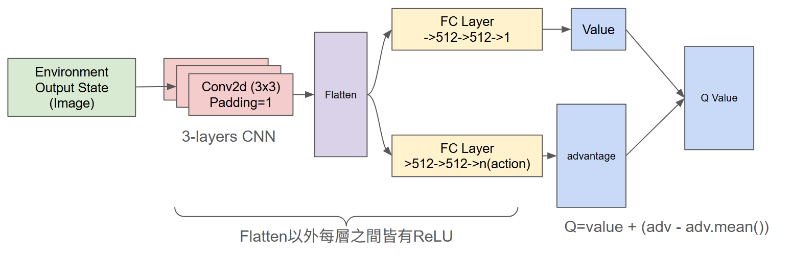

# Sawblades AI

基於強化學習 (Reinforcement Learning) 的實作專案，訓練 AI 在真實遊戲《A Slight Chance of Sawblades》中進行遊玩。
本專案使用 **DQN (Deep Q-Network)** 進行訓練。

## 專案特色

- **真實遊戲環境**：將真實遊戲透過自訂的 Gymnasium 環境包裝，使用 `windll` 與 OpenCV 進行遊戲畫面的擷取與前處理（包含灰階化、顏色遮罩萃取與 4 幀畫面堆疊）。
- **精準記憶體分數讀取**：不同於使用 OCR 辨識，結合 Cheat Engine 與 `pymem` 直接從實機記憶體位址準確抓取即時得分，確保判斷得分的準確性。
- **穩定訓練的神經網路架構**：實作 **Dueling Double DQN** 作為主網路，並採用經驗回放建立離線學習機制，配合 Soft Target Update、Huber loss 與梯度裁剪提升穩定度。
- **克服實時遊戲的時間波動**：為了避免模型產生多餘的時間雜訊，將不固定的遊戲時長強制加入了穩定間隔等待，並且把模型訓練與梯度更新推移至每一次「遊戲回合結束後」統一進行。
- **獎勵設計**：除了單純的得分與死亡，藉由遊戲機制設計了「可能得分」的輔助獎勵狀態，用以解決獎勵過於稀疏的問題。

## 遊戲實機遊玩
https://github.com/user-attachments/assets/863aff07-8a62-4cee-a550-119dea1bf960

## 模型架構

## 檔案結構

- `env.py`: 包含與遊戲視窗互動的環境設定，負責畫面擷取、控制、遊戲狀態偵測與獎勵生成。
- `train.py`: 負責 DQN 的訓練、經驗採樣、優化、模型儲存與 TensorBoard 記錄。
- `test.py`: 載入模型進行實機測試。
- `utils/replay_buffer.py`: 高效的經驗回放池 (Replay Buffer) 與畫面堆疊處理。
- `tools/`: 各種環境與測試用的工具腳本（例如環境測試 `check_env.py`、確認 CUDA `check_cuda.py` 等）。
- `checkpoints/`: 用於存放模型。
- `runs/`: 存放 TensorBoard 日誌。

